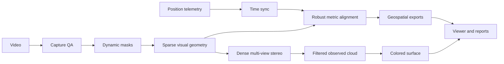

# SinglePass3D

[](https://github.com/Tanishk756/SinglePass3D/actions/workflows/ci.yml)
[](https://github.com/Tanishk756/SinglePass3D/actions/workflows/pages.yml)

**Single-pass video reconstruction with explicit geometry provenance.**

SinglePass3D converts moving-camera video and synchronized position telemetry into
georeferenced camera trajectories, sparse or dense point clouds, measurable local
coordinates, diagnostic reports, and exportable 3D surfaces.

[Live interactive showcase](https://tanishk756.github.io/SinglePass3D/) ·
[Windows setup](docs/windows-setup.md) · [Capture guide](docs/capture-guide.md) ·
[Reference benchmark](docs/reference-demo.md)

## What it delivers

- **Capture intelligence:** blur, exposure, feature support, motion, overlap, and
  homography-dominance diagnostics before costly processing.
- **Validated visual geometry:** GPU SIFT extraction, sequential matching, incremental
  mapping, bundle adjustment, reprojection checks, and triangulation-angle checks.
- **Metric georeferencing:** synchronized GPS/flight metadata, explicit ellipsoidal or
  orthometric altitude handling, robust outlier rejection, trajectory-geometry checks,
  and a local East-North-Up coordinate frame in meters.
- **Dynamic-scene resistance:** optional YOLO segmentation masks prevent people and
  vehicles from driving camera pose estimation.
- **Dense reconstruction:** geometric-consistency multi-view stereo, fused observed
  points, voxel reduction, and statistical outlier filtering.
- **AI evidence:** optional Depth Anything V2 maps are retained as relative inferred
  evidence and never mislabeled as surveyed geometry.
- **3D products:** colored PLY point clouds, vertex-colored OBJ/GLB surfaces, GeoJSON
  trajectories, camera poses, machine-readable metrics, and an interactive viewer.
- **Operational resilience:** checkpointed stages resume compatible work instead of
  repeating an entire mission after interruption.

## Measured reference result

A synchronized 1920×1080 reference flight was processed end to end on an RTX 2060:

| Metric | Result |
|---|---:|
| Registered cameras | 35 / 35 |
| Sparse points | 9,616 |
| Feature observations | 94,977 |
| Mean track length | 9.88 |
| Mean reprojection error | 0.889 px |
| GPS alignment RMSE | 0.748 m |
| Dense fused points | 1,381,333 |
| Filtered observed points | 83,817 |
| Surface triangles | 547,755 |
| Recorded processing time | 33.5 minutes |

GPS alignment RMSE measures agreement with supplied onboard GPS. Independent survey
accuracy requires checkpoints, RTK/PPK, or ground control.

## Launch the studio

Requirements: Windows 11, Python 3.11, FFmpeg, and COLMAP.

```powershell
cd C:\SinglePass3D
.\setup.ps1 -Full -IncludeCuda
.\run-app.ps1
```

Open `http://localhost:8501`.

1. Upload an MP4/MOV flight, or select a bounded webcam/RTSP/HTTP capture.
2. Add CSV or JSON telemetry for metric output.
3. Choose **Fast**, **Balanced**, **Quality**, or **Advanced**.
4. Select a sparse preview or dense cloud and mesh.
5. Follow stage progress, inspect metrics, download products, and open the local 3D viewer.

The browser showcase performs a live 2D feature and motion preview. Live sources are
captured for a selected window, then processed locally with joint camera optimization.
Dense 3D is a GPU-backed staged computation rather than instantaneous per-frame geometry.

## Command line

Metric reconstruction:

```powershell
.\run.ps1 reconstruct `
  --video ".\data\input\flight.mp4" `
  --telemetry ".\data\telemetry\flight.csv" `
  --start-time "2026-01-01T10:00:00Z" `
  --config ".\configs\advanced.yaml" `
  --output ".\data\output\flight-01" `
  --full
```

Video-only visual reconstruction:

```powershell
.\run.ps1 reconstruct-video `
  --video ".\data\input\flight.mp4" `
  --output ".\data\output\visual-test" `
  --config ".\configs\fast.yaml"
```

Video-only output uses arbitrary reconstruction units. Metric measurement requires
synchronized telemetry. For reliable intrinsics, enter calibrated camera parameters in
the studio; leaving them empty asks COLMAP to estimate them from the mission.

## Processing graph



## Input formats

Telemetry CSV or JSON requires:

- `timestamp`
- `latitude`
- `longitude`
- `altitude`

Optional fields: `roll`, `pitch`, `yaw`, `velocity_x`, `velocity_y`, and
`velocity_z`. Timestamps may be Unix seconds or timezone-aware ISO-8601.

See [telemetry format](docs/telemetry-format.md) and [accuracy guidance](docs/accuracy.md).

## Output contract

Each mission contains:

- versioned checkpoint records and stage logs
- synchronized frame telemetry
- sparse and dense reconstruction artifacts
- local ENU transform and camera trajectory
- observed PLY clouds
- optional relative-depth evidence
- vertex-colored OBJ and GLB surfaces
- JSON metrics and HTML report

Reports distinguish observed, aligned, interpolated, and inferred products.

## Engineering limits

Monocular reconstruction needs translational camera motion and scene overlap. Rotation
from one position cannot provide stable depth. Occlusion, collinear flight, rolling
shutter, blur, repeated texture, moving objects, reflections, clock offset, antenna
lever arm, GPS uncertainty, and altitude-datum mismatch can degrade results.

See [limitations](docs/limitations.md), [benchmarking](docs/benchmarking.md), and
[model backend strategy](docs/model-backends.md).

## Development

```powershell
.\test.ps1
.\.venv\Scripts\python.exe -m ruff check src tests scripts streamlit_app.py
.\.venv\Scripts\python.exe -m build
```

The repository includes Windows CI, tagged release builds, issue templates, security
policy, citation metadata, and GitHub Pages deployment.

## License

MIT. Dataset and model assets retain their own licenses.
