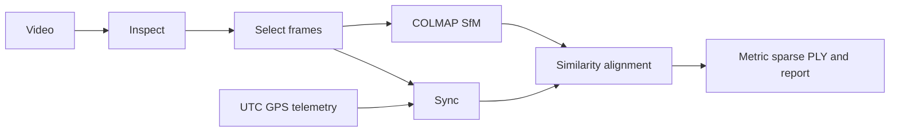

# Architecture

`singlepass3d.cli` drives mission stages through `core.run_stage`. Each stage records version, schema, configuration hash, source identities, and artifact paths. The cache accepts a checkpoint only when all match and artifacts exist.

The sparse cloud is observed geometry from COLMAP. GPS provides a local ENU reference and scale through matched camera centers. A future depth branch must label its inferred geometry separately. Modules are independent of the parent React application.
