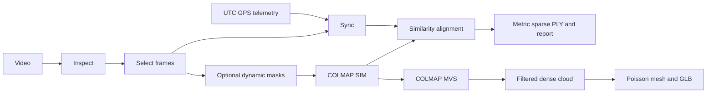

# Architecture

`singlepass3d.cli` drives mission stages through `core.run_stage`. Each stage records version, schema, configuration hash, source identities, and artifact paths. The cache accepts a checkpoint only when all match and artifacts exist.

The sparse and fused clouds are observed geometry from COLMAP. GPS provides a local ENU reference and scale through matched camera centers. Depth Anything produces separately labeled relative inferred depth. Poisson output is an inferred surface between observed samples. Modules can run from any Windows project directory.
